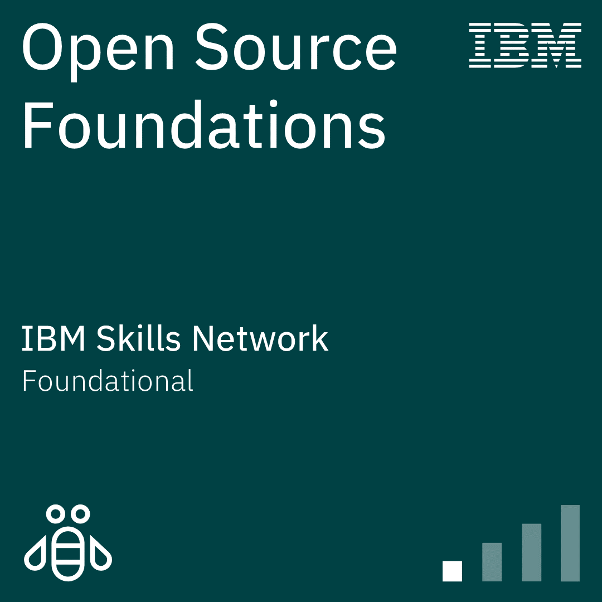
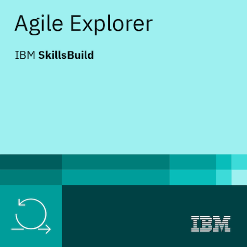
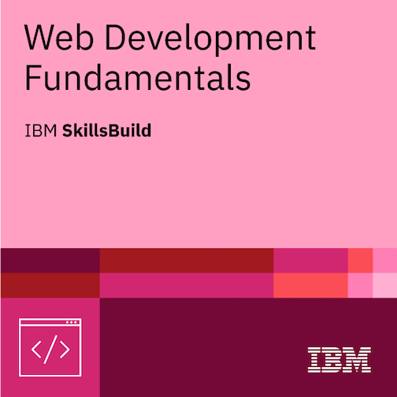
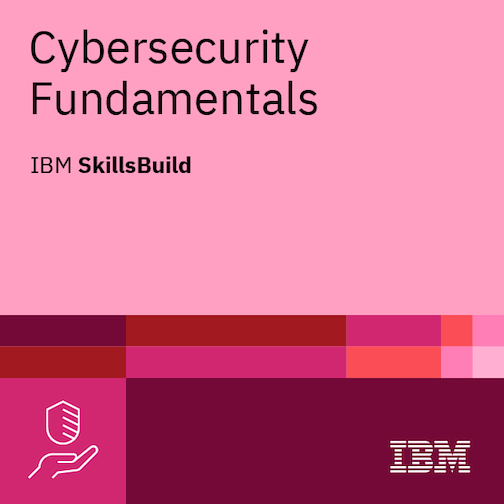

# 🎓 Holberton School France — IBM Certificates

---

> *A collection of IBM certificates earned during the Holberton School France curriculum and personal learning journey.*

---

## 📚 Table of Contents

- [🎯 Trimester 1](#-trimester-1)
- [🌟 Personal Certificates](#-personal-certificates)
- [💻 Technical Skills](#-technical-skills)
- [🧠 Soft Skills](#-soft-skills)
- [📊 Progress Overview](#-progress-overview)
- [🏆 Achievements](#-achievements)

---

## 🎯 Trimester 1

<table>
  <tr>
    <th>Certificate</th>
    <th>Skills</th>
    <th>Preview</th>
  </tr>
  <tr>
    <td><strong>Open Source Foundations</strong></td>
    <td>
      • Open Source Principles 
      • Community Collaboration 
      • Licensing & Contributions
    </td>
    <td></td>
  </tr>
  <tr>
    <td><strong>Agile Explorer</strong></td>
    <td>
      • Agile Methodology 
      • Scrum Framework 
      • Sprint Planning 
      • Continuous Integration/Deployment
    </td>
    <td></td>
  </tr>
</table>

---

## 🌟 Personal Certificates

<table>
  <tr>
    <th>Certificate</th>
    <th>Skills</th>
    <th>Preview</th>
  </tr>
  <tr>
    <td><strong>Web Development Fundamentals</strong></td>
    <td>
      • HTML5 & CSS3 
      • JavaScript ES6+ 
      • Responsive Design 
      • DOM Manipulation 
      • Web Best Practices 
      • Testing & Deployment
    </td>
    <td></td>
  </tr>
  <tr>
    <td><strong>Cybersecurity Fundamentals</strong></td>
    <td>
      • Security Principles (CIA Triad) 
      • Threat Analysis & Risk Management 
      • Offensive Security (Red Team) 
      • Defensive Security (Blue Team) 
      • Cryptography & Network Security 
      • Incident Response
    </td>
    <td></td>
  </tr>
</table>

---

## 💻 Technical Skills

### Programming Languages

### Frameworks & Libraries

### Cybersecurity Tools & Concepts

### Key Competencies

| Domain | Skills |
|:------:|:------:|
| **Web Development** | Responsive Design • SEO • Accessibility • Web Performance |
| **Cybersecurity** | Threat Intelligence • Risk Assessment • Cryptography • SIEM |
| **DevOps** | CI/CD • Git/GitHub • Agile/Scrum • Testing Automation |
| **Networking** | TCP/IP • DNS • Firewalls • VPN • DMZ Architecture |

---

## 🧠 Soft Skills

### Professional Competencies Acquired

<table>
  <tr>
    <th>Skill</th>
    <th>Description</th>
    <th>Level</th>
  </tr>
  <tr>
    <td></td>
    <td>Analyzing complex cybersecurity challenges, identifying potential threats, and making informed decisions</td>
    <td>⭐⭐⭐⭐⭐</td>
  </tr>
  <tr>
    <td></td>
    <td>Identifying sources of security incidents and developing effective technical solutions</td>
    <td>⭐⭐⭐⭐⭐</td>
  </tr>
  <tr>
    <td></td>
    <td>Conveying complex technical information to both technical and non-technical audiences</td>
    <td>⭐⭐⭐⭐</td>
  </tr>
  <tr>
    <td></td>
    <td>Working effectively with cross-functional teams, consultants, and stakeholders</td>
    <td>⭐⭐⭐⭐⭐</td>
  </tr>
  <tr>
    <td></td>
    <td>Quickly adapting to emerging technologies, new processes, and evolving threat landscapes</td>
    <td>⭐⭐⭐⭐⭐</td>
  </tr>
  <tr>
    <td></td>
    <td>Carefully observing and analyzing security measures, processes, and data for subtle clues</td>
    <td>⭐⭐⭐⭐</td>
  </tr>
  <tr>
    <td></td>
    <td>Thinking like attackers to anticipate vulnerabilities and designing innovative security solutions</td>
    <td>⭐⭐⭐⭐</td>
  </tr>
</table>

### Additional Professional Skills

---

## 📊 Progress Overview

| Category | Completed | In Progress | Total |
|:--------:|:---------:|:-----------:|:-----:|
| **Trimester 1** | 2 | 0 | 2 |
| **Personal** | 2 | 0 | 2 |
| **Total** | **4** | **0** | **4** |

### Skills Mastery

| Domain | Courses Completed | Certificates | Proficiency |
|:------:|:-----------------:|:------------:|:-----------:|
| **Web Development** | 7 | 1 |  |
| **Cybersecurity** | 4 | 1 |  |
| **Soft Skills** | 11 | 4 |  |

---

## 🏆 Achievements

### 🎯 Completed Learning Paths

#### 🌐 Web Development Track (7 courses)
- ✅ Fundamentals of the Web *(1h40)*
- ✅ Web Development for the Web *(1h40)*
- ✅ Introduction to HTML & CSS *(1h30)*
- ✅ JavaScript Programming for the Web
- ✅ Testing & Deploying Web Sites *(1h30)*
- ✅ Interactive Web Page — To-Do List *(1h50)*
- ✅ Your Future in Web Development

#### 🔐 Cybersecurity Track (4 courses)
- ✅ Introduction to Cybersecurity *(1h15)*
- ✅ Cybersecurity: On the Offensive — Red Team *(2h50)*
- ✅ Cybersecurity: On the Defense — Blue Team *(2h05)*
- ✅ Your Future in Cybersecurity: The Job Market *(1h)*

### 📈 Total Learning Hours

**19+ hours** of hands-on training across Web Development and Cybersecurity domains

---

## 📫 Contact

**Soufiane Filali**

---

### 🌟 Fun Facts

**Languages Spoken:** 🇫🇷 French (Native) • 🇬🇧 English (Fluent)

**Currently Learning:** Purple Team Tactics • Cloud Security (AWS/Azure) • Advanced Penetration Testing

---

*Last updated: April 6, 2026*

**Made with ❤️ by Soufiane Filali**

